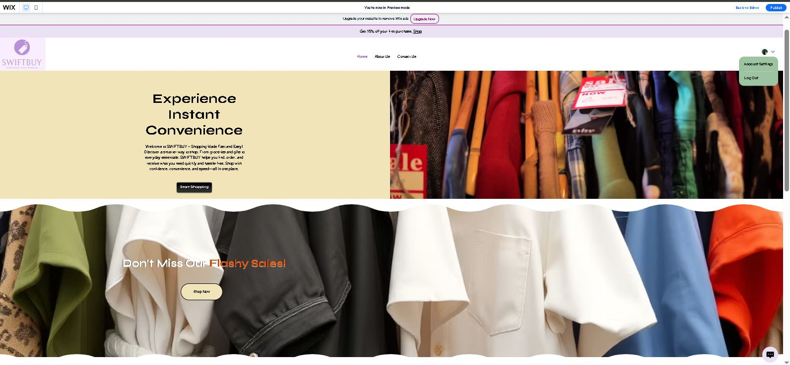
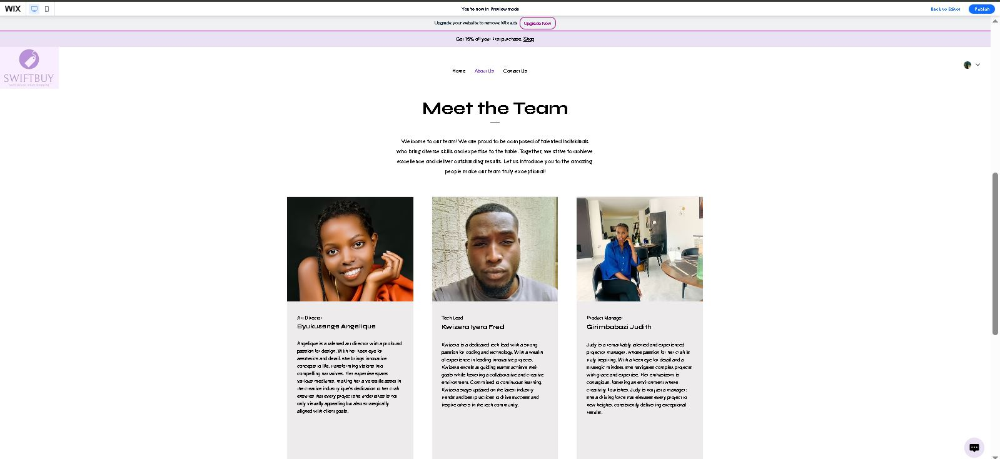
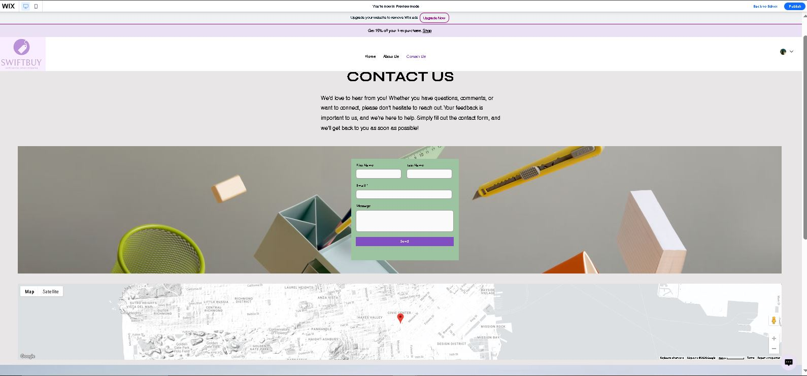
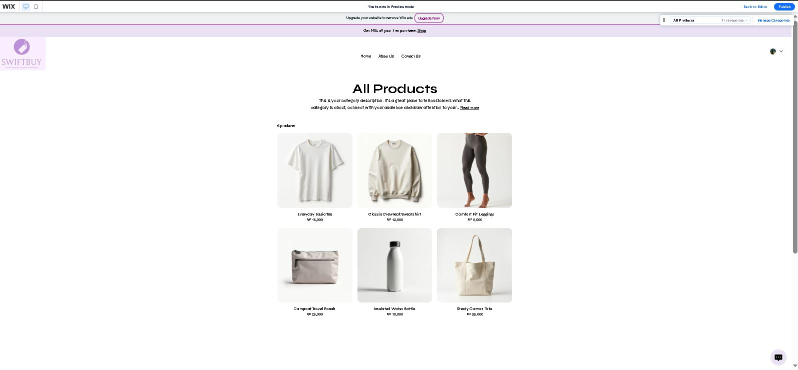
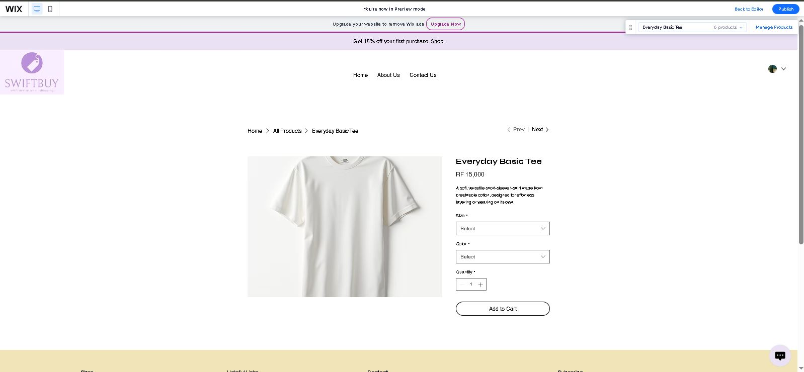

# 🛍️ SwiftBuy — No-Code E-Commerce Application

> *Shopping Made Fast and Easy!*

---

## 👤 Student Information

| Field | Details |
|---|---|
| **Names** |Kwizera Iyera Fred.Byukusenge Angelique.Girimbabazi Judith|
| **Registration number** |23718/2024.24022/2024.24180/2024|
| **Role** |Tech Lead.Art director.Project Manager|
| **Course** | E-Commerce And Web Application — EWA408510 |
| **Institution** | University of Lay Adventists of Kigali (UNILAK) |
| **Lecturer** | Mr.Eric Maniraguha |
| **Academic Year** | 2025–2026 · Semester II |
| **Submission Date** | June 08, 2026 |

---

## 📌 Project Title

**SwiftBuy** — A No-Code E-Commerce Website built with Wix

---

## 🛠️ Platform Used

- **Platform:** [Wix](https://www.wix.com)
- **Type:** No-Code / Low-Code Website Builder
- **Reason for Choice:** Wix offers a drag-and-drop editor, built-in e-commerce (Wix Stores), contact forms, and map integration — making it ideal for rapidly building a fully functional store without writing code.

---

## ✅ Features Implemented

### Pages
- **Homepage** — Store name, welcome message, hero section with "Experience Instant Convenience" tagline, and a "Don't Miss Our Flashy Sales!" promotional section with a Shop Now CTA
- **Product Page** — 6 products listed with images, names, descriptions, and prices in RWF
- **About Page** — Team introduction with photos, roles, and bios for all three members
- **Contact Page** — Contact form (First Name, Last Name, Email, Message) + embedded Google Map

### Functionality
- 🛒 **Add-to-Cart** — Wix Stores native cart integration on product listings
- 👤 **User Account** — Login / Account Settings accessible from the navigation bar
- 🗺️ **Google Maps** — Embedded location map on the Contact page
- 📬 **Contact Form** — Functional form that allows customers to send messages
- 📢 **Promotional Banner** — "Get 15% off your first purchase" announcement bar

---

## 🛒 Products Catalogue

| # | Product | Price (RWF) |
|---|---|---|
| 1 | Everyday Basic Tee | 15,000 |
| 2 | Classic Crewneck Sweatshirt | 12,000 |
| 3 | Comfort Fit Leggings | 8,000 |
| 4 | Compact Travel Pouch | 25,000 |
| 5 | Insulated Water Bottle | 10,000 |
| 6 | Sturdy Canvas Tote | 35,000 |

---

## 📸 Screenshots

### 🏠 Homepage

*Hero section featuring the SwiftBuy tagline and a promotional flash-sale banner.*

### 👥 About Page

*Meet the Team — Art Director, Tech Lead, and Product Manager profiles.*

### 📞 Contact Page

*Contact form with First Name, Last Name, Email, Message fields, and an embedded Google Map.*

### 🛍️ Products Page

*All Products listing — 6 items with images and RWF pricing.*

### 🛍️ Cart Page

*Cart page showing added items, quantities, and checkout option.*

---

## ⚠️ Challenges Faced

1. **Image Sizing Consistency** — Getting product images to display at uniform dimensions across the Wix Store grid required manual cropping and focal-point adjustments within Wix's media manager.
2. **Currency Customization** — Wix's default currency settings needed to be changed to Rwandan Franc (RWF), which required navigating through the Wix Stores payment settings.
3. **Map Embedding** — Pinpointing the exact store location on the embedded Google Map and adjusting the zoom level to display correctly on all screen sizes took several iterations.
4. **Responsive Design** — Ensuring the layout looked good on both desktop and mobile views required switching between the desktop and mobile editors in Wix to fix overlapping elements.
5. **Team Coordination** — Collaborating on a single Wix account while dividing design, content, and technical responsibilities required clear communication and scheduled working sessions.

---

## 💡 Lessons Learned

1. **No-Code platforms are powerful** — Wix enables rapid prototyping of fully functional e-commerce stores without writing a single line of code, which is ideal for quick deployment.
2. **UI/UX matters from the start** — Planning the page layout and color palette before building saved significant redesign time during development.
3. **Content is as important as design** — Writing clear product descriptions and team bios improved the overall professionalism of the site considerably.
4. **GitHub documentation is a professional skill** — Structuring a README.md with clear sections, tables, and embedded images mirrors real-world software project documentation practices.
5. **Teamwork amplifies output** — Dividing responsibilities by skill (design, tech, product management) allowed each member to contribute meaningfully and produce a higher-quality result than working alone.

---

## 🌐 Live Website

🔗 **[https://kwizmemories.wixsite.com/swiftbuy](https://kwizmemories.wixsite.com/swiftbuy)**

---

## 📁 GitHub Repository

🔗 [https://github.com/KWIZERA-FRED/SwiftStore-no-code](https://github.com/KWIZERA-FRED/SwiftStore-no-code)

---
